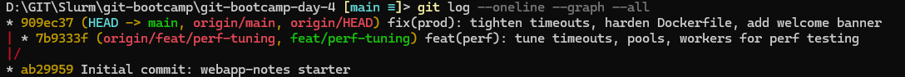
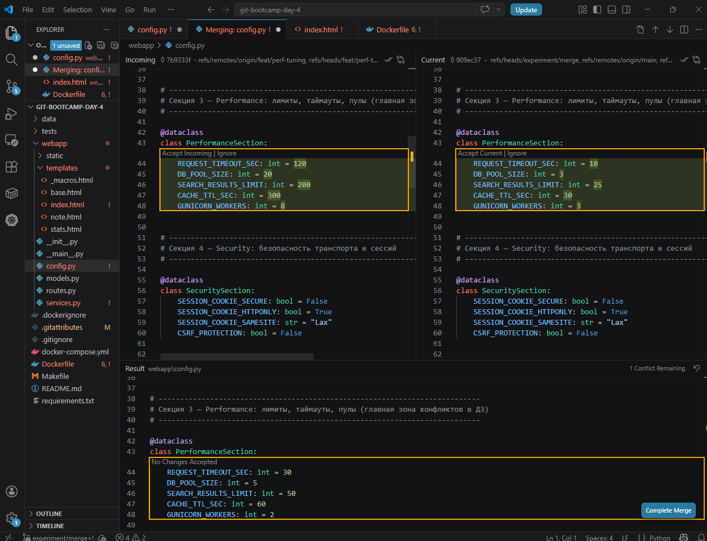
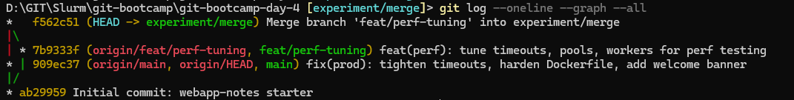
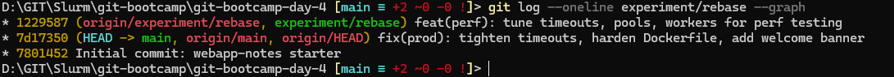
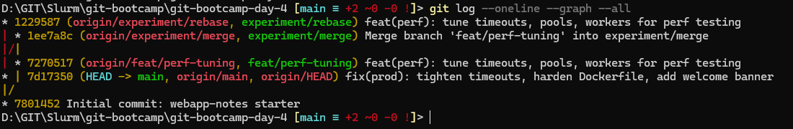
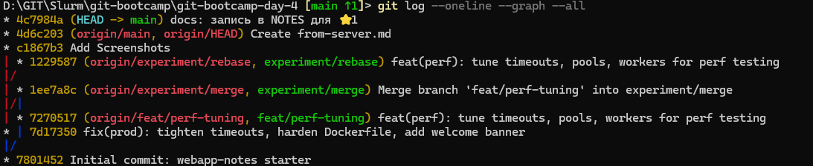
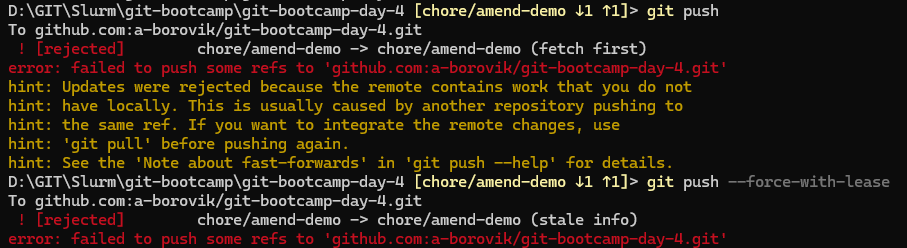
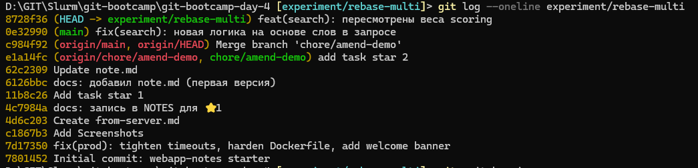
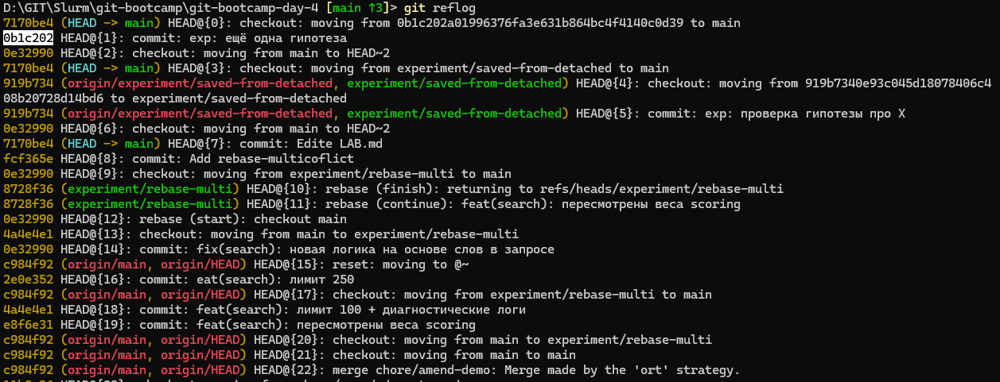

# LAB — день 4

Курс: [«Интенсив по погружению в GIT»](https://slurm.io/git-intensive)


## Базовая задача — `01-merge-vs-rebase`

### Стартовое состояние

Было сделано перед началом разрешения конфликтов: ветка `feat/perf-tuning`, 4 файла были изменены webapp/config.py webapp/services.py webapp/templates/index.html Dockerfil; встречный коммит на `main`

```bash
# git log --oneline --graph --all (на момент окончания подготовки)
```



### Путь A — через `merge`

В ветке `experiment/merge`, webapp/config.py и webapp/templates/index.html разрешал через VS Code Merge Editor остальные через CLI. 

```bash
# ключевые команды
```





### Путь B — через `rebase`


```bash
# ключевые команды
```



### Сравнение

Финальная история всех веток рядом:



Что я заметил в процессе сравнения:
- размер истории,
- отсутствие merge-коммита —
- хеши коммитов фичи разные
- невидна в истории ветка как сущность.


### Какой подход я бы выбрал(а) в команде и почему

Свободный ,например: для слияния готовой фичи в общий `main` через PR — `merge` (или `merge --no-ff`); для обновления **своей** приватной ветки от свежего `main` перед PR — `rebase`. Подкрепите свой выбор тем, что увидели в этом задании.

## Задания со звездочкой (опционально)
> это заполняете только если делали. иначе не включайте в отчет и удалите их шаблона

### ⭐1 — `git pull` vs `git pull --rebase`

Что было воспроизведено, какая разница в истории получилась, какую глобальную настройку поставили в `~/.gitconfig`.



### ⭐2 — `--force-with-lease` vs `--force`

--force-with-lease` безопаснее `--force`, не даёт случайно запароть ветку с чужими изменениями.



### ⭐3 — rebase с конфликтом на каждом коммите

Сюжет, через сколько `--continue` прошли, что почувствовали по сравнению с пассивным merge.



### ⭐4 — безопасный выход из detached HEAD

Как зашли в detached HEAD, какой коммит сделали, как выходили через `git switch -c`, чем `git reflog` помог как страховка.



